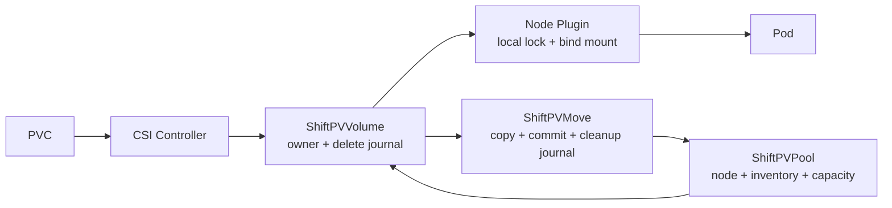

# ShiftPV

ShiftPV는 기존 Linux filesystem 위의 node-local directory를 Kubernetes RWO PVC로 제공하고,
계획된 cold move를 통해 살아 있는 두 node 사이에서 owner를 옮기는 CSI driver다.

> **0.4 contract status:** 0.4.0 runtime은 repository gate, 실제 node의 unclean OS reboot 경계 시험,
> 100회·12시간 soak를 통과했으며 아래의 명시된 product boundary 안에서 사용한다.

## Start here

[Quickstart](docs/quickstart.md)는 공개된 Chart 0.5.10 / Controller 0.4.11 / Node 0.4.7로
설치 → Pool 등록 → PVC 쓰기 → Pod 재생성 후 데이터 확인까지 안내한다.
기존 클러스터의 기본 StorageClass를 바꾸지 않으며 PVC에서 `storageClassName`을 명시한다.
이미 설치했다면 [CRD 선적용 및 upgrade 안내](docs/development/versioning.md#existing-installation-upgrades)를 따른다.

## Architecture



Application I/O는 owner node의 local bind mount만 사용한다. Network path는 이동 중 정지된 volume을
복사할 때만 사용한다.

0.4의 durable API surface는 세 resource뿐이다.

| Resource | 책임 |
|---|---|
| `ShiftPVPool` | node-local path, readiness, causal scan과 complete inventory |
| `ShiftPVVolume` | PVC identity, 단일 owner, capacity reservation, deletion journal |
| `ShiftPVMove` | 한 번의 이동, owner commit, temporary holds, rollback/source cleanup journal |

Helper Job은 filesystem effect를 실행할 뿐 authority나 완료 사실을 소유하지 않는다.

## Contract

| 영역 | 0.4 보증 |
|---|---|
| Volume | Dynamic RWO filesystem provisioning |
| Placement | `WaitForFirstConsumer`; exact owner node에만 publish |
| Storage | 참여 node마다 운영자가 준비한 absolute non-root Pool directory 하나 |
| Capacity | 모든 owner, incoming, retained copy를 cleanup 정산까지 보수적으로 계산 |
| Observation | current Pool generation과 일치하고 action fence 이후인 valid·complete inventory만 사용 |
| Mobility | source/destination이 복구 가능한 계획된 cold move |
| Commit | Volume owner compare-and-swap 한 번만 authority를 변경 |
| Recovery | commit 전에는 source로 abort, commit 후에는 destination으로 forward recovery |
| Cleanup | durable intent와 exact receipt 뒤 fresh absence를 확인하고 finalizer/hold 해제 |
| GC | transaction으로 설명되는 garbage만 자동 삭제; unknown orphan은 report-only |
| Removal | Volume, Move, copy, hold가 남으면 Pool/release 제거를 fail closed |

핵심 규칙은 간단하다.

```text
fence source publish
  → wait for NodeUnpublish to inspect mounts and clear the API fence
  → reserve and copy to destination
  → verify complete copy
  → compare-and-swap owner                 # only commit point
  → prove destination is actually mounted
  → purge source with durable receipt
  → post-receipt generation-fenced source-absence proof
  → release hold and complete
```

Partial copy, stale/truncated inventory, identity contradiction은 owner 변경이나 삭제를 승인하지 않는다.
Node가 일시적으로 사라지면 transaction과 finalizer를 보존하고 같은 node가 돌아온 뒤 재개한다.

## Storage boundary

```text
<registered Pool>/
├── volumes/                authoritative copies
└── .shiftpv/
    ├── incoming/           uncommitted destination copies
    ├── retired/            cleanup staging
    └── identity/receipts   exact copy and operation evidence
```

ShiftPV는 이 directory 아래만 관리한다. Disk, filesystem 생성·mount·암호화·RAID·backup·복제는
운영자 또는 외부 storage system 책임이다. 영구적으로 유실된 authoritative disk/node의 데이터를
복구하거나 자동으로 다른 copy를 owner로 승격하지 않는다.

## Requirements

| Requirement | Value |
|---|---|
| Kubernetes contract target | 1.35+ |
| Nodes | Linux kernel 5.6+ (`openat2`) |
| Access | privileged Node DaemonSet and node-bound root helper |
| Pool | existing writable absolute non-root directory |
| Access mode | RWO filesystem |

MicroK8s는 보통 kubelet root로 `/var/snap/microk8s/common/var/lib/kubelet`을 사용한다.

## Validation

0.4 프로토콜과 환경 전제는 다음 명령으로 독립 검증한다.

```bash
make v04-model
make v04-kubernetes-primitives
make v04-filesystem-primitives
```

이 검사는 상태 모델과 primitive만 확인한다. 실제 운영 승인은 구현 unit/race, Linux mount,
isolated Kind fault injection, 실제 node의 unclean OS reboot와 soak를 모두 통과해야 한다. 자세한 구분은
[Testing](docs/development/testing.md)에 있다.

## Documentation

| 질문 | 문서 |
|---|---|
| 무엇을 보증해야 하는가? | [0.4 contracts](docs/spec/README.md) |
| 왜 이 구조인가? | [ADR](docs/adr/README.md) |
| 어떻게 구현하고 검증하는가? | [Development](docs/development/README.md) |
| 어떻게 설치하고 운영하는가? | [Helm chart guide](charts/shiftpv/README.md) |
| 버전과 artifact를 어떻게 릴리즈하는가? | [Versioning](docs/development/versioning.md) |

## License

Apache-2.0 — see [LICENSE](LICENSE).
