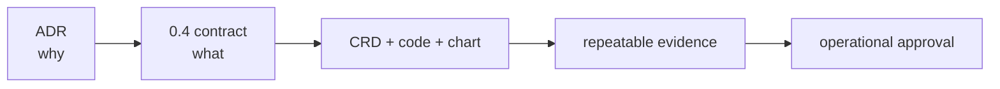

# ShiftPV Documentation

문서는 한 사실을 한 곳에서만 소유한다. 과거 동작과 변경 일지는 Git history와 release가 보존하며,
본문은 0.4 구현과 운영에 필요한 현재 계약만 설명한다.

처음 설치한다면 [Quickstart](quickstart.md)에서 시작한다.

| 영역 | 소유하는 내용 | Index |
|---|---|---|
| ADR | 구조를 선택한 이유와 trade-off | [adr/](adr/README.md) |
| Spec | 구현·운영 승인에 필요한 normative behavior | [spec/](spec/README.md) |
| Development | source 책임과 반복 가능한 evidence gate | [development/](development/README.md) |
| Operations | 설치, 설정, 관측, 장애 대응과 제거 | [Helm chart guide](../charts/shiftpv/README.md) |

각 문서의 version 표기를 따른다. 현재 checkout의 구현과 문서는 같은 계약을 표현해야 하지만,
model·static·Kind 테스트 성공을 실제 disk의 power-loss 내구성이나 운영 release 보증으로 확대하지 않는다.
